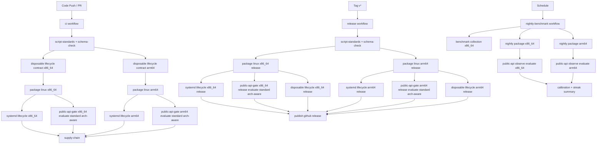

# Workflow Architecture / 工作流架构

## English

Repository workflows:

- `ci`
- `release`
- `nightly-benchmark`

### Trigger model

- `ci`: branch `push`, `pull_request`, `workflow_dispatch`
- `release`: tag `v*` push, `workflow_dispatch`
- `nightly-benchmark`: schedule + manual dispatch

### G3.3 blocking relation

### Blocking policy

- CI and release both use `--profile standard`.
- Both Linux architectures are mandatory.
- Any public-api gate failure blocks downstream publish chain (`supply-chain` in CI, `publish` in release).
- Release disposable lifecycle gates (`tar.gz` full + `rpm` install-uninstall) are hard blockers before `publish`.
- CI disposable lifecycle contract checks are lightweight pre-gates to catch script-interface drift before release.
- Nightly now collects observe samples on both Linux architectures and emits calibration/streak reports for threshold tuning.
- Nightly summary now also emits:
  - threshold PR checklist (`threshold-pr-checklist.md`)
  - threshold change proposal (`threshold-change-proposal.md`)
  - milestone-2 closure synthesis (`milestone2-closure-status.json/.md`)
  - closure weekly report (`closure-weekly-report.md`)
- Gate jobs now run with explicit timeout and long-run evaluate windows.
- `script-standards` now includes fixture backend SIGTERM termination regression check.
- `script-standards` now also enforces `print_stage` -> `stderr` log channel contract.
- `systemd-lifecycle-linux-x86_64` and `systemd-lifecycle-linux-arm64` now run with workflow-level timeout guards.

### Audit artifacts

Public API gate jobs upload:

- `result.json`
- `summary.md`

These artifacts include architecture, duration profile, request-floor checks, and explicit failure reasons.

Release disposable lifecycle jobs upload:

- `result.json`
- `summary.md`

These artifacts include stage-level status for install/upgrade/rollback/uninstall and cleanup diagnostics.

Nightly calibration summary uploads:

- `calibration-report.json`
- `calibration-report.md`
- `streak-report.json`
- `streak-report.md`
- `threshold-pr-checklist.md`
- `threshold-change-proposal.md`
- `milestone2-closure-status.json`
- `milestone2-closure-status.md`
- `closure-weekly-report.md`

These artifacts support manual threshold tuning and milestone-2 closure tracking (10 consecutive dual-arch green runs in both CI and release).

G3.4.1 说明（中文）:

- nightly 汇总阶段新增 `threshold-pr-checklist.md` 与 `milestone2-closure-status.json/.md`
- `milestone2-closure-status` 会同时读取 CI 与 release streak 结果，输出 `closure_ready` 与 `remaining_to_target`
- 该链路用于收口可视化和人工决策，不新增 release 硬阻断

### CI hang containment boundaries

- fixture process layer:
  - bounded stop contract (`TERM` -> bounded wait -> `KILL` -> explicit fail)
- script execution layer:
  - key `systemctl` calls wrapped with command timeout in Linux systemd validation
  - stage logs are isolated on `stderr`, and evaluate summary paths are wired explicitly (no stdout capture pollution)
- workflow orchestration layer:
  - explicit `timeout-minutes` on long-running systemd lifecycle jobs
- diagnosis expectation:
  - failures should surface as actionable diagnostics, not silent 6h hangs

## 中文

仓库工作流包括：

- `ci`
- `release`
- `nightly-benchmark`

### 触发模型

- `ci`：分支 `push`、`pull_request`、`workflow_dispatch`
- `release`：`v*` tag 推送、`workflow_dispatch`
- `nightly-benchmark`：定时 + 手动触发

### G3.3 阻断关系

- CI 与 release 均采用 `--profile standard`。
- `x86_64` 与 `arm64` 两条公网 API 门禁必须同时通过。
- 任一门禁失败即阻断后续链路：
  - CI 阻断 `supply-chain`
  - release 阻断 `publish`
- release 已新增一次性环境全生命周期门禁（`tar.gz` 全流程 + `rpm` 安装/卸载），任一失败都会阻断 `publish`。
- CI 已新增一次性环境全生命周期脚本的轻量契约检查，用于提前发现脚本接口漂移。
- nightly 已新增双架构 observe 采样与校准/连续全绿统计汇总，用于阈值校准证据沉淀。
- 门禁 job 已接入明确超时与长跑 evaluate 窗口。
- `script-standards` 已加入 fixture backend 的 SIGTERM 退出回归校验。
- `script-standards` 新增 `print_stage` 必须写 `stderr` 的通道约束。
- `systemd-lifecycle-linux-x86_64` 与 `systemd-lifecycle-linux-arm64` 已增加 workflow 级超时保护。

### 审计产物

公网 API 门禁 job 固定上传：

- `result.json`
- `summary.md`

产物中包含架构、时长档位、最小样本门槛检查与明确失败原因，便于回溯审计。

一次性环境全生命周期门禁 job 固定上传：

- `result.json`
- `summary.md`

产物中包含安装/升级/回滚/卸载分阶段状态与清理诊断字段，便于发布审计和回归定位。

nightly 校准汇总 job 固定上传：

- `calibration-report.json`
- `calibration-report.md`
- `streak-report.json`
- `streak-report.md`

产物用于“先报告后调阈值”的校准闭环和“连续 10 次双架构全绿”收口跟踪。

### CI 卡死治理边界

- fixture 进程层：
  - 有界停止契约（`TERM` -> 有限等待 -> `KILL` -> 显式失败）
- 脚本执行层：
  - Linux systemd 验证中的关键 `systemctl` 调用都带命令级超时
  - stage 日志与 stdout 返回值隔离（写 stderr），evaluate summary 路径改为显式传递
- workflow 编排层：
  - 长耗时 systemd lifecycle job 配置 `timeout-minutes`
- 诊断目标：
  - 失败必须可解释、可复盘，不再出现静默 6 小时挂死
