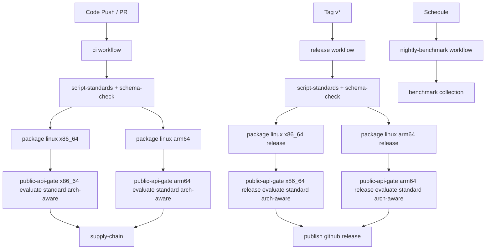

# Workflow Architecture / 工作流架构

## English

Repository workflows:

- `ci`
- `release`
- `nightly-benchmark`

### Trigger model

- `ci`: branch `push`, `pull_request`, `workflow_dispatch`
- `release`: tag `v*` push, `workflow_dispatch`
- `nightly-benchmark`: schedule + manual dispatch

### G3.1 blocking relation

### Blocking policy

- CI and release both use `--profile standard`.
- Both Linux architectures are mandatory.
- Any public-api gate failure blocks downstream publish chain (`supply-chain` in CI, `publish` in release).
- Gate jobs now run with explicit timeout and long-run evaluate windows.

### Audit artifacts

Public API gate jobs upload:

- `result.json`
- `summary.md`

These artifacts include architecture, duration profile, request-floor checks, and explicit failure reasons.

## 中文

仓库工作流包括：

- `ci`
- `release`
- `nightly-benchmark`

### 触发模型

- `ci`：分支 `push`、`pull_request`、`workflow_dispatch`
- `release`：`v*` tag 推送、`workflow_dispatch`
- `nightly-benchmark`：定时 + 手动触发

### G3.1 阻断关系

- CI 与 release 均采用 `--profile standard`。
- `x86_64` 与 `arm64` 两条公网 API 门禁必须同时通过。
- 任一门禁失败即阻断后续链路：
  - CI 阻断 `supply-chain`
  - release 阻断 `publish`
- 门禁 job 已接入明确超时与长跑 evaluate 窗口。

### 审计产物

公网 API 门禁 job 固定上传：

- `result.json`
- `summary.md`

产物中包含架构、时长档位、最小样本门槛检查与明确失败原因，便于回溯审计。
