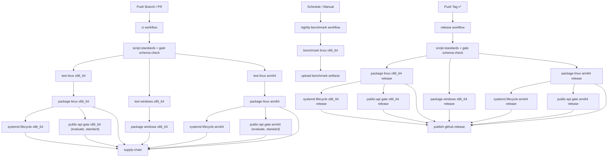

# Workflow Architecture / 工作流架构

## English

This document defines trigger rules, responsibilities, and dependency order for repository workflows.

Workflows:

- `ci`
- `release`
- `nightly-benchmark`

### Trigger Rules

- `ci`: branch `push`, `pull_request`, `workflow_dispatch`
- `release`: tag `push` matching `v*`, `workflow_dispatch`
- `nightly-benchmark`: scheduled run and manual dispatch

### Responsibility Matrix

- `ci`: validate code, build artifacts, run systemd lifecycle checks, run public API gate checks, then run supply-chain checks
- `release`: build release artifacts, run lifecycle and public API release gates, then publish GitHub Release assets
- `nightly-benchmark`: trend-only benchmark collection, no release blocking

### Dependency Graph

### Blocking Semantics

- In `ci`, public API gate failures block downstream `supply-chain`.
- In `release`, public API gate failures block `publish`.
- Both Linux architectures (`x86_64`, `arm64`) are mandatory for gate pass.

### Artifacts For Audit

Public API gate jobs upload:

- `result.json`
- `summary.md`

These artifacts are used for release confidence review and regression tracing.

## 中文

本文档定义仓库工作流的触发规则、职责边界和依赖顺序。

工作流：

- `ci`
- `release`
- `nightly-benchmark`

### 触发规则

- `ci`：分支 `push`、`pull_request`、`workflow_dispatch`
- `release`：匹配 `v*` 的 tag `push`、`workflow_dispatch`
- `nightly-benchmark`：定时任务与手动触发

### 职责矩阵

- `ci`：代码验证、打包、systemd 生命周期验证、公网 API 门禁验证，最后执行供应链检查
- `release`：构建发布产物，执行生命周期与公网 API 发布门禁，最后发布 GitHub Release
- `nightly-benchmark`：用于趋势采集，不参与发版阻断

### 阻断语义

- 在 `ci` 中，公网 API 门禁失败会阻断后续 `supply-chain`
- 在 `release` 中，公网 API 门禁失败会阻断 `publish`
- 两个 Linux 架构（`x86_64`、`arm64`）必须同时通过

### 审计产物

公网 API 门禁 job 会上传：

- `result.json`
- `summary.md`

这些产物用于发布评审和回归追踪。
