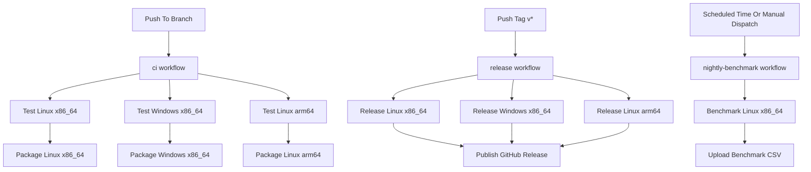
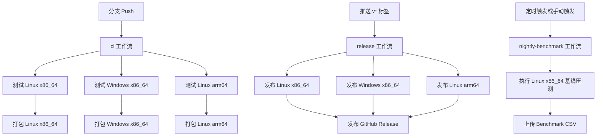

# Workflow Architecture / 工作流架构

## English

This document explains the trigger model, responsibilities, and execution order of the three repository workflows:

- `ci`
- `release`
- `nightly-benchmark`

### High-Level Graph

### Trigger Rules

- `ci` runs on branch `push`, `pull_request`, and manual dispatch.
- `release` runs on tag push matching `v*`, and can also be started manually.
- `nightly-benchmark` runs on schedule and manual dispatch.

### Relationship Between The Three Workflows

- The three workflows do not wait on each other by default.
- A single repository event can trigger more than one workflow.
- A branch push can trigger `ci`.
- A tag push like `v0.1.5` can trigger `release`.
- If both branch and tag are pushed around the same time, `ci` and `release` can run concurrently.
- `nightly-benchmark` is independent from both and is intended for trend observation, not release gating.

### Internal Ordering

Workflow-level ordering is independent, but each workflow has its own internal dependency chain.

For `ci`:

1. run tests on Linux x86_64, Windows x86_64, and Linux arm64
2. package each platform only after its corresponding test job succeeds
3. upload build artifacts for download from the workflow page

For `release`:

1. build and validate Linux x86_64, Windows x86_64, and Linux arm64 release artifacts
2. download and stage release assets
3. generate and verify `SHA256SUMS.txt`
4. ensure the GitHub Release exists
5. upload release assets to the release page

For `nightly-benchmark`:

1. build the benchmark target
2. run a conservative baseline on Linux x86_64
3. upload CSV output for historical comparison

### What Each Workflow Produces

`ci`:

- validation status for branch changes
- downloadable temporary artifacts on the Actions run page
- no GitHub Release entry

`release`:

- versioned release assets attached to the GitHub Release page
- `SHA256SUMS.txt`
- the repository's formal downloadable release entry

`nightly-benchmark`:

- benchmark CSV files stored as workflow artifacts
- no release asset
- no package registry publication

### Operational Guidance

- If you want to validate branch code, check `ci`.
- If you want a formal downloadable version in the repository sidebar, check `release`.
- If you want performance trend data, check `nightly-benchmark`.
- `Packages` remaining empty is expected, because the repository currently publishes release assets through GitHub Releases rather than GitHub Packages.

## 中文

本文档说明仓库中三套工作流的触发方式、职责边界和执行关系：

- `ci`
- `release`
- `nightly-benchmark`

### 高层关系图

### 触发规则

- `ci` 在分支 `push`、`pull_request` 和手动触发时运行。
- `release` 在推送匹配 `v*` 的标签时运行，也支持手动触发。
- `nightly-benchmark` 在定时任务和手动触发时运行。

### 三套工作流之间的关系

- 三套工作流默认彼此不等待。
- 一个仓库事件可以同时触发多套工作流。
- 分支 push 会触发 `ci`。
- 像 `v0.1.5` 这样的标签 push 会触发 `release`。
- 如果分支和标签在接近时间一起推送，`ci` 和 `release` 可以并发运行。
- `nightly-benchmark` 与前两者独立，主要用于趋势观察，而不是发版闸门。

### 工作流内部顺序

工作流之间默认独立，但每个工作流内部都有自己的依赖链。

对于 `ci`：

1. 先在 Linux x86_64、Windows x86_64、Linux arm64 上跑测试
2. 对应平台的测试通过后，才进入对应平台的打包 job
3. 最后把产物作为临时 artifacts 上传到 workflow 页面

对于 `release`：

1. 先构建并验证 Linux x86_64、Windows x86_64、Linux arm64 的发布产物
2. 再下载并整理 release assets
3. 生成并校验 `SHA256SUMS.txt`
4. 确保 GitHub Release 条目存在
5. 把发布产物上传到 Release 页面

对于 `nightly-benchmark`：

1. 构建 benchmark 目标
2. 在 Linux x86_64 上执行保守基线压测
3. 上传 CSV 输出供后续趋势对比

### 每套工作流产出什么

`ci`：

- 分支改动的验证状态
- Actions 页面可下载的临时 artifacts
- 不会生成 GitHub Release 条目

`release`：

- 挂到 GitHub Release 页面上的版本化发布资产
- `SHA256SUMS.txt`
- 仓库右侧可见的正式发布版本

`nightly-benchmark`：

- 作为 workflow artifacts 保存的 benchmark CSV 文件
- 不会生成 release asset
- 不会发布到 package registry

### 运维视角的使用建议

- 想验证分支代码是否稳定，看 `ci`
- 想得到仓库右侧可下载的正式版本，看 `release`
- 想看性能趋势数据，看 `nightly-benchmark`
- 右侧 `Packages` 为空是正常现象，因为当前仓库是通过 GitHub Releases 分发版本，而不是通过 GitHub Packages 发布
